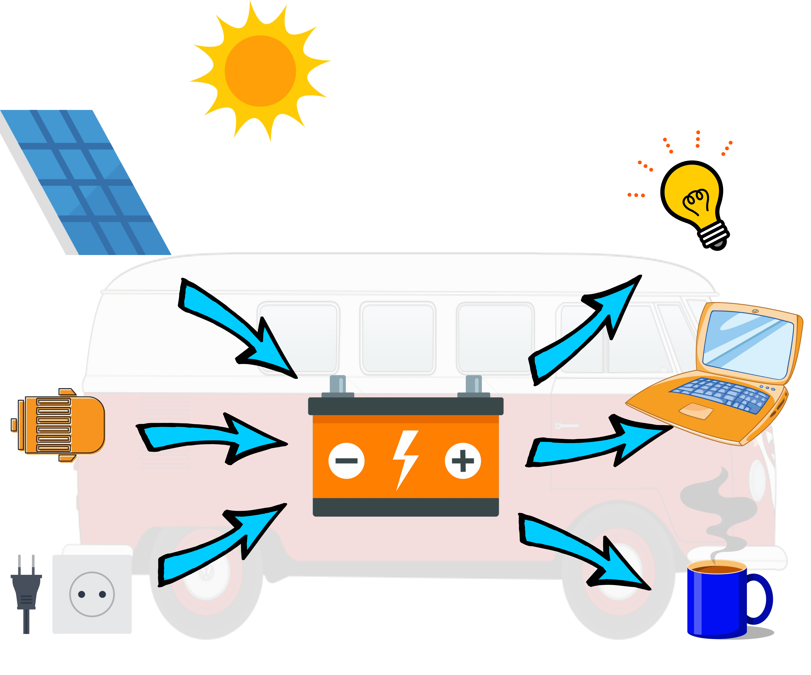

# Camper Van Electricity

## How to size your electrical system

To determine the size of a solar system for a camper is not very easy in practice, because 
      you can not always estimate your needs. Here I would like to give a few standard suggestions 
      to make this easier and to see the impact of the cost.

Start the tool [https://freegroup.github.io/CampingElectricCalculator/](https://freegroup.github.io/CampingElectricCalculator/)

