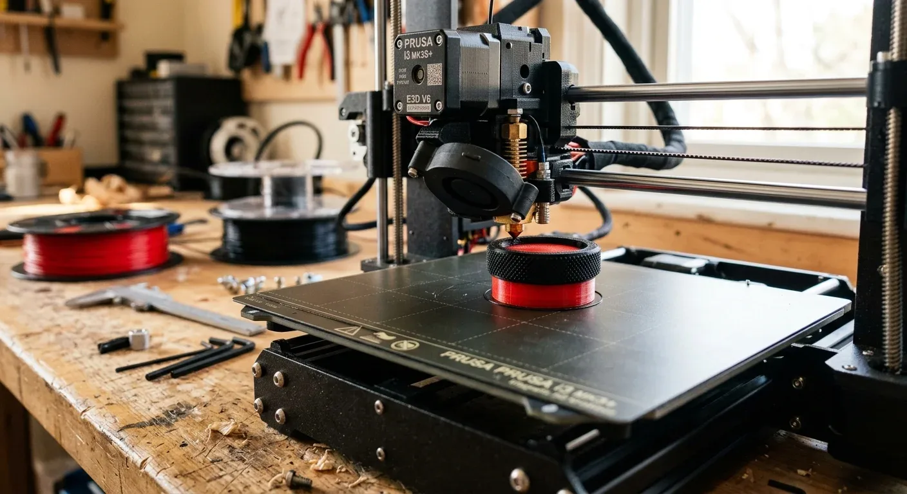

Fettige Finger vom Kochen, holprige Schotterpiste und dann versucht man, das Licht am glatten, billigen Plastikknopf des China-Dimmers zu regulieren – frustrierend. Standardknöpfe sehen lieblos aus, rutschen durch und passen selten perfekt auf die Achse des Potentiometers. Die Lösung liegt auf dem 3D-Drucker: Ein maßgeschneiderter Dual-Material-Drehknopf.

Der Trick für maximale Griffigkeit ist die Kombination aus zwei Filamenten: Ein steifer Kern aus PLA für die D-Schaft-Passung der Steuerung und ein flexibler Außenring aus TPU für den nötigen Grip. Wer keinen Dual-Extruder besitzt, nutzt auf Druckern wie dem Snapmaker einfach den manuellen Filamentwechsel per Z-Pause im Slicer. 

Damit sich die beiden Materialien unlösbar verbinden, ist die Temperatur der entscheidende Kniff. PLA wird meist kälter gedruckt, TPU heißer. Ein Kompromiss bei ca. 215 °C sorgt dafür, dass sich die TPU-Schichten chemisch fest mit dem PLA-Kern verschmelzen. So schält sich im harten Camper-Alltag und unter Sommerhitze nichts voneinander ab.

Der schickste Knopf nützt allerdings nichts, wenn das Bauteil dahinter zur Brandfalle wird. Ein typischer LED-Dimmer steuert schnell Ströme von 5 Ampere. Wird die Zuleitung hierfür zu dünn gewählt, droht durch den hohen Widerstand ein Kabelbrand im engen Camper-Kabelbaum.

Wer beispielsweise einen Dimmer über der Küchenzeile verbaut und dafür 4 Meter einfache Leitungslänge (400 cm) bei einer 12-V-Systemspannung benötigt, darf nicht schätzen. Bei 5 A Dauerstrom und einem maximal zulässigen Spannungsfall von 2 % ergibt die präzise Berechnung inklusive einer Sicherheitsmarge von 12 % einen rechnerischen Querschnitt von 2,98 mm². Aufgerundet auf die nächste handelsübliche Kabelgröße bedeutet das: Es muss eine Zuleitung mit mindestens **4 mm²** Querschnitt verlegt werden.

Passt dein Kabelquerschnitt zum Rest deiner Installation? Berechne die Zuleitung für dein konkretes Projekt direkt im [Kabelquerschnitt-Rechner](https://camper-elektrik-planer.de/de/kabelquerschnitt-berechnen/) und plane das gesamte System sicher im [Camper-Elektrik-Planer](https://camper-elektrik-planer.de/).
