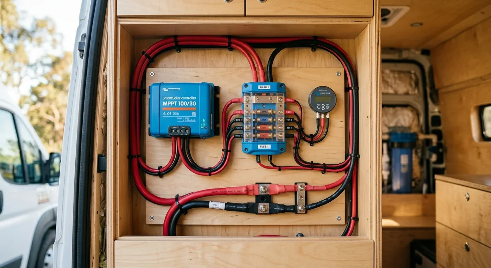

Ich saß damals stundenlang im leeren, entkernten Kastenwagen und habe einfach nur Löcher in die Luft gestarrt. Auf den ersten Blick sieht das nach Stillstand aus – fast so wie der Moment, in dem man in einem leeren Saal sitzt und darauf wartet, dass es losgeht. Aber genau diese Ruhephase vor dem eigentlichen Start hat mir später extrem viel Frust und vor allem unnötiges Geld erspart. Wer direkt mit dem Seitenschneider in der Hand loslegt und blind Kabel bestellt, baut sich schnell Fehler ein, die sich später nur schwer wieder korrigieren lassen.

Die größte Stolperfalle beim Ausbau ist das Schätzen. „Ach, das Kabel sieht doch dick genug aus“ oder „bei anderen klappt das auch so“ sind im 12-Volt-Bereich gewagte Herangehensweisen. Anders als bei der Hausinstallation mit 230 Volt führen ungenaue Kabelquerschnitte im Camper schon bei kleinen Abweichungen zu spürbaren Spannungsverlusten. Die Verbraucher am Ende der Leitung bekommen dann einfach nicht mehr die Energie, die sie eigentlich brauchen, arbeiten ineffizient oder schalten wegen Unterspannung ab.

Ich nehme als Beispiel gerne die Zuleitung für den Ladebooster, der die Aufbaubatterie während der Fahrt lädt. Sagen wir, der Booster liefert 30 Ampere Ladestrom und der einfache Weg von der Starterbatterie im Motorraum bis zum Booster hinten im Ausbau beträgt 5 Meter. 

Gefühlsmäßig greifen viele Selbstausbauer hier zu einem 16 mm² Kabel, weil das im Laden schon ordentlich massiv wirkt. Rechnet man das Ganze aber sauber durch – unter Berücksichtigung von Hin- und Rückweg des Stroms, einem maximal zulässigen Spannungsfall von 2 % und einer Sicherheitsmarge von 12 % –, spuckt die Physik ein anderes Ergebnis aus. Exakt benötigt werden hier rechnerisch 22,32 mm². Da es diese Größe nicht im Handel gibt, ist der nächsthöhere Standard-Querschnitt **35 mm²**. 

Mit dem vermeintlich „ausreichenden“ 16 mm² Kabel würde schlicht zu viel Spannung auf dem langen Weg verloren gehen. Der Ladebooster könnte nicht mehr seine volle Leistung erbringen.

Am Ende ist es ganz einfach: Jedes Kabel im Camper sollte einmal kurz durchgerechnet werden. Das nimmt die Unsicherheit und gibt das beruhigende Gefühl, dass später alles verlässlich läuft. Für die schnelle Überprüfung einzelner Leitungen nutze ich den [Kabelquerschnitt-Rechner](https://camper-elektrik-planer.de/de/kabelquerschnitt-berechnen/). Wer direkt die gesamte Elektrik inklusive Absicherung und Stückliste im Blick behalten will, plant sein System am besten im [Camper-Elektrik-Planer](https://camper-elektrik-planer.de/).
