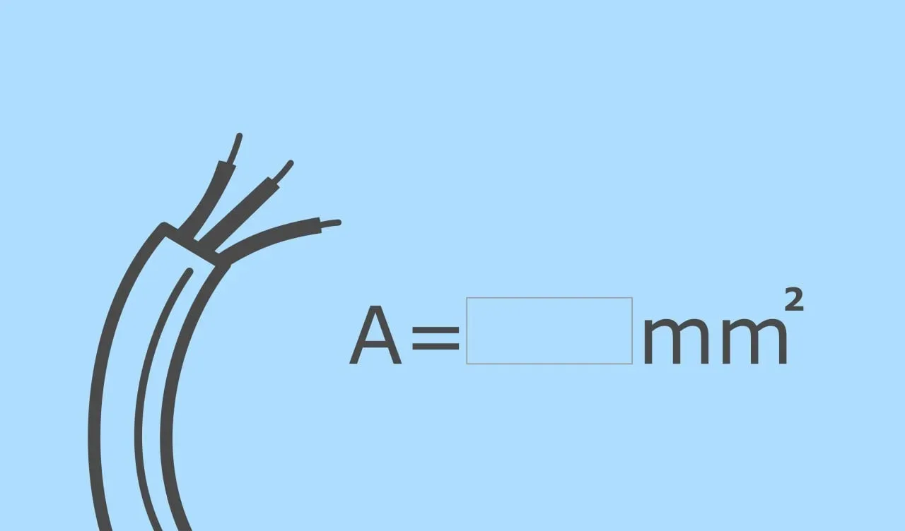
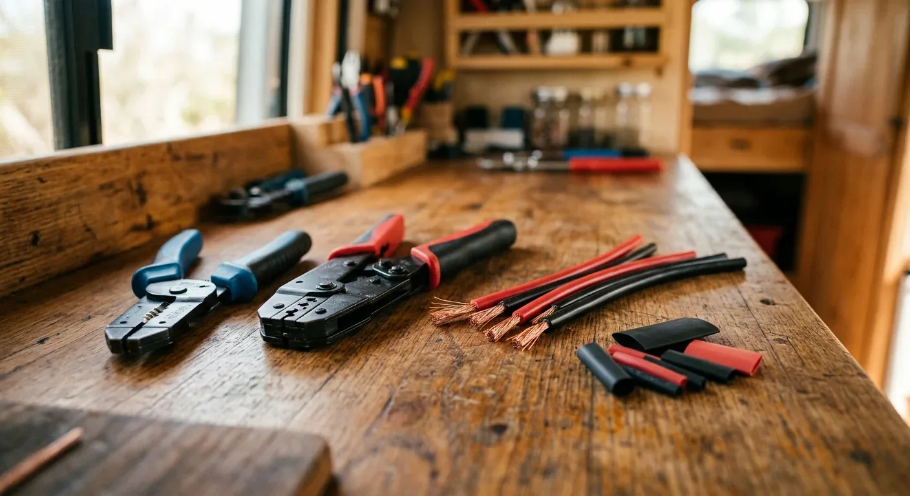

Bei meinem ersten Van-Ausbau dachte ich: „Ach, 12 Volt ist doch kaum Spannung, da fließt nicht viel – da reichen die dünnen Kabel aus der Restekiste völlig.“ Ein klassischer Trugschluss. In Wahrheit ist bei 12-Volt-Systemen im Camper der Spannungsabfall der größte Endgegner. Da die Ausgangsspannung so niedrig ist, macht sich jeder kleinste Verlust sofort bemerkbar. Am Ende schaltet sich die Kühlbox wegen Unterspannung ab, obwohl die Batterie eigentlich noch voll ist.

Dazu kommt ein physikalisches Detail, das man leicht vergisst: Der Strom muss immer im Kreis fließen. Wir müssen für den Widerstand also immer den Hin- und den Rückweg betrachten – die Kabellänge verdoppelt sich für den Stromfluss quasi.

Schauen wir uns das an einem ganz typischen Beispiel an: Eine normale Kompressor-Kühlbox benötigt im Betrieb etwa 5 Ampere Strom. Wenn die Box hinten im Heck steht und die Batterie weiter vorne verbaut ist, kommen wir schnell auf eine einfache Leitungslänge von 4 Metern (also 400 Zentimetern). 

Rechnet man das exakt durch – mit den üblichen 2 % maximal zulässigem Spannungsfall und einer Sicherheitsmarge von 12 % –, ergibt sich rechnerisch ein benötigter Kabelquerschnitt von exakt 2,98 mm². Da es Kabel in dieser Stärke im Handel nicht gibt, rundet man in der Praxis immer auf den nächsten Standardwert auf. In diesem Fall greift man also zu einem Kabel mit 4 mm² Querschnitt.

Damit läuft die Kühlbox absolut stabil, ohne dass unterwegs wertvolle Energie auf dem Weg durch das Kabel verloren geht. 

Dieses Prinzip gilt für jeden Verbraucher an Bord – von der Standheizung über die USB-Dosen bis hin zum Ladebooster. Damit du nicht jedes Mal selbst den Taschenrechner herausholen musst, kannst du die Werte für deine Geräte einfach direkt im [Kabelquerschnitt-Rechner](https://camper-elektrik-planer.de/de/kabelquerschnitt-berechnen/) eingeben. Der spuckt dir in Sekunden den passenden Querschnitt für dein Projekt aus.
