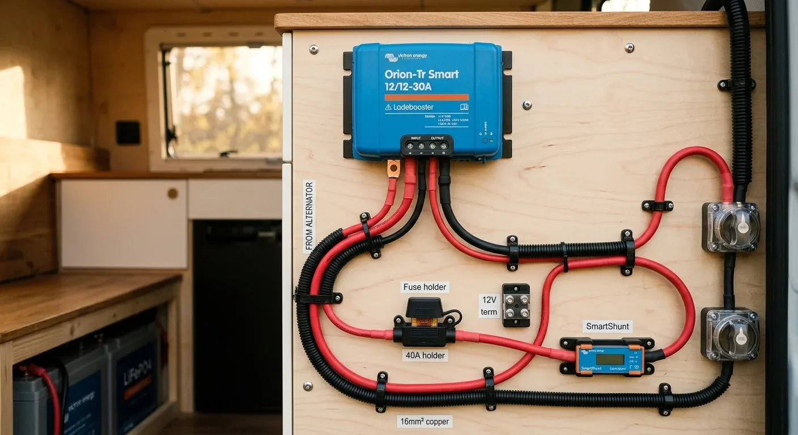

Ich saß damals genau so da wie auf dem Foto – im stillen Kämmerchen, den Kopf voller Pläne und vor mir ein leerer Notizblock. Die Elektrik im Van stand an und ich hatte absolut keinen Plan, wo ich anfangen soll. Man will ja nicht einfach irgendwelche Kabel bestellen, die am Ende zu dünn sind oder ungenutzt in der Kiste liegen bleiben. Gründliches Nachdenken vor dem ersten Kauf spart einfach massig Frust, Zeit und bares Geld.

Das Problem beim Selbstausbau: Viele kaufen ihre Kabel einfach nach Gefühl, nach Empfehlungen aus Foren oder blind nach irgendwelchen Tabellen aus dem Internet. Dabei wird der wichtigste Faktor oft komplett ignoriert: der reale Spannungsabfall auf der Strecke. Im 12-Volt-System ist die Spannung so niedrig, dass selbst kleine Widerstände im Kabel dafür sorgen, dass am Ende nicht mehr genug Power ankommt. Das Gerät streikt dann einfach, obwohl die Batterie voll ist.

Um das zu verhindern, rechnen wir das Ganze lieber einmal sauber durch, statt zu schätzen. Nehmen wir als Beispiel einen klassischen Ladebooster, den du von der Starterbatterie zum Wohnraum-Akku legst:

* **Ladestrom:** 30 Ampere
* **Bordnetz:** 12 Volt
* **Einfache Kabellänge:** 3 Meter (300 cm)

Wenn wir hier mit einem maximalen Spannungsverlust von 2 % und einer Sicherheitsmarge von 12 % rechnen, ergibt sich ein exakter theoretischer Querschnitt von 13,39 mm². Da es dieses Maß im Handel nicht gibt, runden wir auf den nächsten Standardwert auf: 16 mm². Mit dieser Leitung bist du auf der sicheren Seite, und der Booster bekommt genau den Saft, den er zum effizienten Laden braucht.

Damit du dich nicht durch physikalische Formeln quälen musst, kannst du das ganz einfach für jeden deiner Verbraucher – von der Kühlbox bis zur Standheizung – mit unserem [Kabelquerschnitt-Rechner](https://camper-elektrik-planer.de/de/kabelquerschnitt-berechnen/) ermitteln. Und wenn du gleich das gesamte System samt Absicherung und Schaltplan planen willst, hilft dir der [Camper-Elektrik-Planer](https://camper-elektrik-planer.de/) dabei, den Überblick zu behalten.
