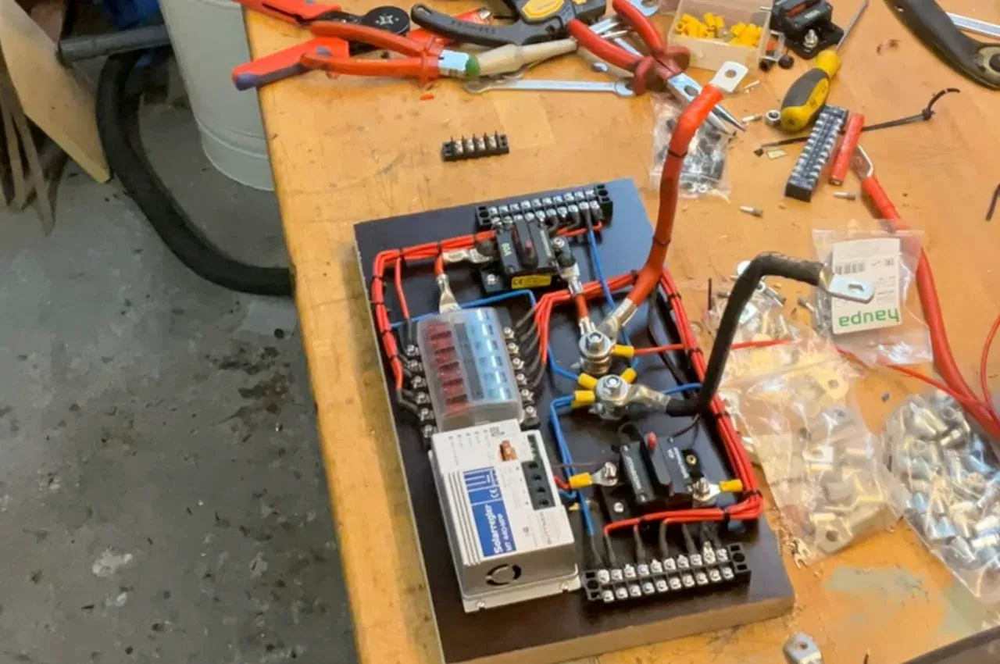

Wer schon mal kopfüber mit der Taschenlampe im Mund in einer engen, dunklen Sitzkiste lag, um ein widerspenstiges Kabel in eine Klemme zu zwingen, weiß: Das ist kein Vanlife, das ist Folter. Es geht zehnmal geiler. Du baust die gesamte Elektrik einfach flach und entspannt auf der Werkbank auf.

Auf diesem strukturierten Elektrik-Board ist alles kompakt auf einer stabilen Platte montiert: Ein MPPT-Solarregler, der Sicherungsverteiler für die 12-V-Verbraucher, solide Busbars (Sammelschienen) zur Stromverteilung und ein robuster Hauptschalter. Wenn alles auf der Platte fertig verdrahtet ist, hebst du das gesamte Board in deinen Camper, schraubst es fest und musst nur noch die Hauptleitungen anschließen. Das ist extrem sauber, übersichtlich und im Fehlerfall bist du sofort an jedem Bauteil dran.

Der größte Fehler beim Board-Bau passiert bei den vermeintlich „kurzen Wegen“. Weil die Abstände zwischen Hauptschalter, Sicherung und Busbar nur ein paar Zentimeter lang sind, wird beim Kabelquerschnitt oft einfach geschätzt. Doch genau hier fließen die höchsten Ströme im ganzen Camper. Zu dünne Kabel erzeugen einen hohen Widerstand, führen zu gefährlichem Spannungsabfall und im schlimmsten Fall zum Kabelbrand direkt unter deiner Matratze.

Machen wir es konkret: Nehmen wir die Hauptzuleitung von diesem Board zur Batterie. Wenn dein System für eine kontinuierliche Stromstärke von 60 A ausgelegt ist und das Board eine Kabellänge von 100 cm (einfacher Weg) von der Batterie entfernt sitzt, darfst du den Querschnitt nicht würfeln. 

Die exakte Berechnung für ein 12-V-System ergibt: Du benötigst für diese Zuleitung einen Kabelquerschnitt von **16 mm²**. Darin sind der maximal zulässige Spannungsverlust von 2 % und eine Sicherheitsmarge von 12 % bereits eingerechnet, damit deine Geräte die volle Spannung bekommen und die Kabel eiskalt bleiben.

Bevor du also die Crimpzange in die Hand nimmst, rechne deine Kabelwege sauber durch. Nutze den kostenlosen [Kabelquerschnitt-Rechner](https://camper-elektrik-planer.de/de/kabelquerschnitt-berechnen/), um jede einzelne Verbindung auf deiner Montageplatte exakt zu dimensionieren. 

Wenn du noch am Anfang stehst und wissen willst, wie Solarregler, Batterie und Ladebooster in deinem Setup am besten zusammenspielen: Plan deinen gesamten Schaltplan inklusive Energiebilanz und Stückliste vorab direkt im [Camper-Elektrik-Planer](https://camper-elektrik-planer.de/). Das spart Zeit, schützt vor teuren Fehlkäufen und sorgt dafür, dass deine Elektrik absolut sicher ist.
