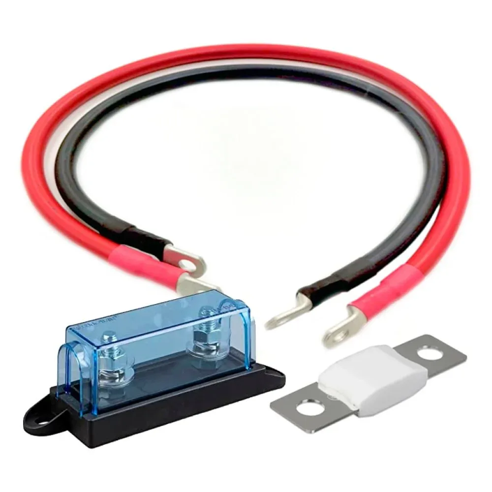

Keine Lust auf ein abgebranntes Auto? Genau dafür sind die Teile auf dem Bild da. Ein Kabelbrand im Camper entsteht schneller, als du "Kurzschluss" sagen kannst. Wenn zu viel Strom durch ein zu dünnes Kabel fließt, wird es heiß, die Isolierung schmilzt und es fängt an zu fackeln. Sicherungen und die passenden Kabelquerschnitte sind kein lästiges Theorie-Projekt, sondern deine Lebensversicherung im Van. Und nein, dafür musst du keine Elektriker-Lehre machen.

### Wie du Watt in Ampere verwandelst

Auf den meisten Geräten steht nur eine Angabe in Watt (W). Für deine Planung brauchst du aber Ampere (A), denn danach wählst du Kabel und Sicherungen aus. Die Formel dafür ist extrem simpel:

**Watt / Volt = Ampere**

Wenn du also einen Verbraucher mit 120 Watt an deinem 12-Volt-System betreibst, rechnest du einfach:
120 W / 12 V = 10 A.

### Die goldene Regel: Sicherungen schützen das Kabel

Merk dir eines sofort: Eine Sicherung schützt niemals das angeschlossene Gerät (wie deine Kühlbox oder dein Handy). Sie schützt ausschließlich das Kabel vor dem Schmelzen. Der Ablauf bei der Planung ist deshalb immer gleich:

1. Stromstärke (Ampere) des Geräts ermitteln.
2. Richtigen Kabelquerschnitt für die Länge berechnen.
3. Die Sicherung passend zum Kabel und knapp über dem maximalen Betriebsstrom des Geräts auswählen.

### Das Rechenbeispiel: Ladebooster mit 40 A

Nehmen wir an, du verbaust einen Ladebooster, der mit maximal 40 A lädt. Das Kabel von der Starterbatterie zum Booster im Wohnraum ist 2 Meter (200 cm) lang. Die Systemspannung beträgt 12 V.

Gibst du diese Werte in den [Kabelquerschnitt-Rechner](https://camper-elektrik-planer.de/de/kabelquerschnitt-berechnen/) ein, spuckt dieser unter Berücksichtigung des Spannungsabfalls und einer Sicherheitsmarge genau **16 mm²** als optimalen Kabelquerschnitt aus.

Um dieses 16 mm² Kabel abzusichern, wählst du eine Sicherung, die knapp über dem Betriebsstrom von 40 A liegt, aber auslöst, bevor das Kabel überlastet wird. Eine **50 A MIDI-Sicherung** (wie im Bild) ist hier die perfekte Wahl.

### Mach es dir einfach

Du musst die Tabellen nicht auswendig lernen. Jag deine Werte einfach durch unseren [Kabelquerschnitt-Rechner](https://camper-elektrik-planer.de/de/kabelquerschnitt-berechnen/) und lass das Tool die Arbeit machen. 

Wenn du direkt die gesamte Elektrik inklusive Batterie, Solar und Ladebooster fehlerfrei planen willst, nutze den kompletten [Camper-Elektrik-Planer](https://camper-elektrik-planer.de/) – damit zeichnest du deinen Schaltplan im Handumdrehen selbst.
