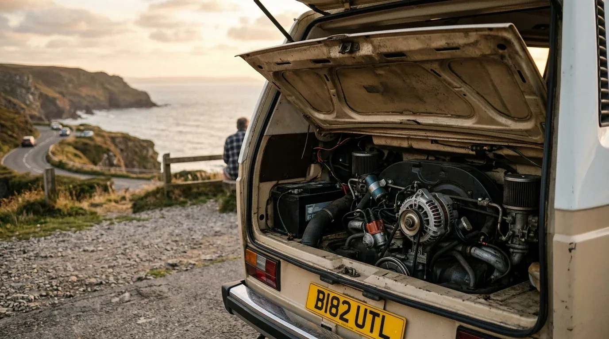

Der Standard-Tipp in fast jedem Forum: „Zieh dir als Erstes ein dickes Kabel von der Starterbatterie nach hinten, sonst kriegst du deine Aufbaubatterie nie voll.“ Aber stimmt das überhaupt? Kurz gesagt: Nein. Wenn dein Solar-Setup gut dimensioniert ist und deine Batteriekapazität zu deinem täglichen Verbrauch passt, kannst du die Lichtmaschine komplett ignorieren. Wer im Sommer autark steht, braucht oft keinen einzigen Tropfen Strom aus dem Motorraum.

Gefährlich wird es, wenn du einen älteren Camper fährst – wie einen T3, Mercedes T1 oder alten Transit – und trotzdem der Foren-Meinung folgst.

### Warum alte Lichtmaschinen an Lithium sterben

Eine klassische Lichtmaschine aus den 80er- oder 90er-Jahren ist für eine einfache Starterbatterie gebaut. Die lädt sich nach dem Motorstart kurz auf und nimmt danach kaum noch Strom auf. Die Lichtmaschine kann sich während der Fahrt abkühlen. 

Wenn du jetzt eine moderne Lithium-Batterie (LiFePO4) installierst und einen großen Ladebooster mit 30 A oder 40 A dranhängst, ändert sich das Spiel komplett. Eine Lithium-Batterie saugt gierig alles auf, was sie kriegen kann – und zwar konstant über Stunden. Die alte Lichtmaschine läuft dauerhaft unter Volllast. Besonders fies: Wenn du im Stau stehst oder langsam durch eine Stadt zuckelst, dreht sich die Lichtmaschine langsam und der interne Lüfter kühlt kaum. Sie überhitzt, brennt durch und du stehst mit leerer Starterbatterie am Straßenrand. Totalschaden mitten im Urlaub.

### Die Lösung: Entweder weglassen oder drosseln

Du hast zwei smarte Optionen, um dieses Risiko zu umgehen:

1. **Komplett autark über Solar:** Wenn du ohnehin nur von Frühling bis Herbst unterwegs bist, plane dein Setup direkt ohne Verbindung zum Motor. Das spart Geld, Gewicht und Nerven beim Einbau.
2. **Den Ladestrom begrenzen:** Wenn du die Lichtmaschine als Backup für Regentage brauchst, wähle einen Ladebooster, bei dem du den Strom begrenzen kannst (z. B. auf moderate 10 A). Das schont die alte Technik und reicht völlig aus, um während einer vierstündigen Fahrt 40 Ah nachzuladen.

### Der Kabel-Vorteil: Dünner, leichter, günstiger

Ein kleinerer Ladestrom schützt nicht nur deine Lichtmaschine, sondern vereinfacht auch die Installation massiv. 

Bei einer typischen Kabellänge von **400 cm** (einfache Strecke von der Starterbatterie zur Wohnmobilbatterie) bei einem 12-V-System sieht der Unterschied so aus:

*   **Bei 30 A Ladestrom:** Du musst ein dickes, starres **25 mm²** Kabel verlegen, um den Spannungsfall unter 2 % zu halten. Das ist teuer und lässt sich nur schwer durch enge Karosserieholme ziehen.
*   **Bei schonenden 10 A Ladestrom:** Du kommst mit einem flexiblen, extrem leicht zu verlegenden **8 mm²** Kabel aus.

Bevor du also teures Kupfer kaufst und deine Lichtmaschine riskierst, solltest du dein System genau kalkulieren. Planst du noch dein Gesamt-Setup, kannst du deinen Camper direkt im [Camper-Elektrik-Planer](https://camper-elektrik-planer.de/) zeichnen und abstimmen. Hast du dich bereits für einen Ladestrom entschieden, berechne den exakten Querschnitt und die passende Absicherung mit dem [Kabelrechner](https://camper-elektrik-planer.de/de/kabelquerschnitt-berechnen/).
