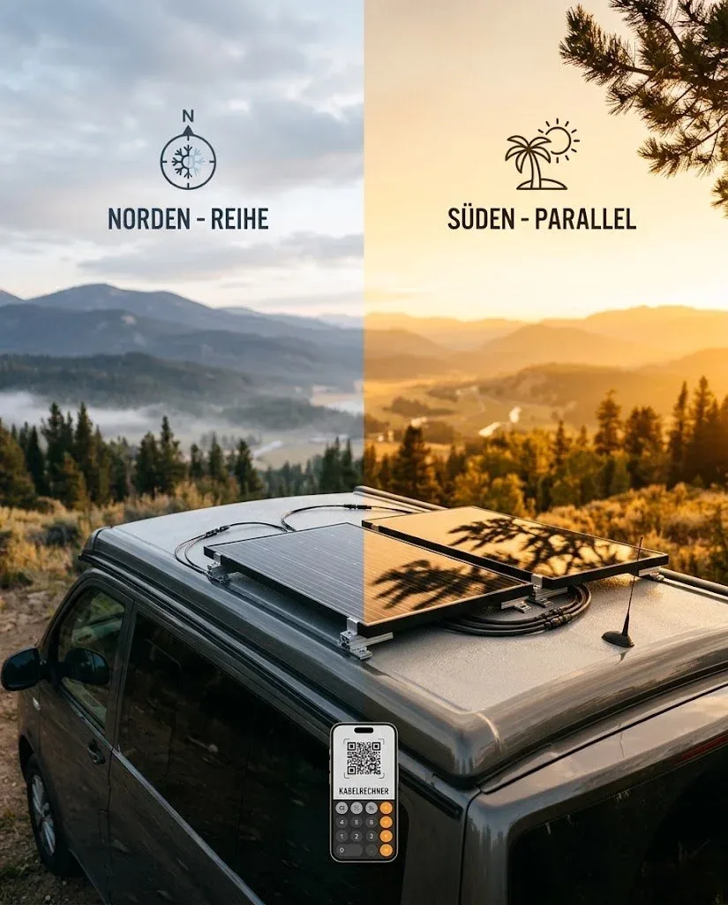

Als ich damals meine zwei Solarmodule auf das Dach geklebt habe, stand ich vor der Frage: In Reihe oder parallel schalten? Am Ende entscheidet das nicht nur darüber, wie viel Strom bei Wolken fließt, sondern auch direkt über die Dicke deiner Kabel.

Wo zieht es dich hin? Deine Reiseziele entscheiden über die Schaltung:

**Reihe für den Norden**
Wenn du im Norden unterwegs bist, wo die Sonne flach steht und es oft bewölkt ist, ist die Reihenschaltung perfekt. Die Spannungen der Module addieren sich. Weil die Gesamtspannung dadurch viel höher ist, springt dein Laderegler morgens viel früher an – er lädt die Batterie selbst bei schwachem Licht. Bei einer Parallelschaltung reicht die Spannung bei dicken Wolken oft gar nicht aus, um den Ladevorgang überhaupt zu starten. Ein netter Nebeneffekt: Bei höherer Spannung fließt weniger Strom durch die Leitung. Die Kabel können dadurch dünner ausfallen.

**Parallel für den Süden**
Im heißen Süden parkst du deinen Camper gern im Halbschatten unter Bäumen. Hier ist die Parallelschaltung im Vorteil. Wird ein Modul verschattet, liefert das andere trotzdem noch die volle Leistung. In Reihe würde das verschattete Modul den gesamten String ausbremsen. Weil sich bei der Parallelschaltung jedoch die Ströme addieren, wandert deutlich mehr Strom durch die Leitungen. Um den Spannungsabfall gering zu halten, brauchst du dickere Kabel.

**Der direkte Vergleich**
Nehmen wir zwei typische 100-Wp-Module (mit je 20 V und 5 A) und eine einfache Kabellänge von 5 Metern bis zum Laderegler:

*   **In Reihe (40 V / 5 A):** Hier kommen wir mit einem Kabelquerschnitt von **2,5 mm²** locker aus (rechnerisch reichen sogar 1,12 mm²). Das Kabel ist dünn, flexibel und lässt sich super verlegen.
*   **Parallel (20 V / 10 A):** Durch den doppelten Strom und die geringere Spannung müssen wir auf **6 mm²** aufrüsten (rechnerisch 4,46 mm²), damit auf dem Weg nicht zu viel Energie verloren geht. 

Welcher Querschnitt für dein eigenes Setup der richtige ist, hängt stark von deiner Modulleistung und der Kabellänge ab. Du kannst das ganz einfach für dein eigenes Projekt mit dem [Kabelrechner](https://camper-elektrik-planer.de/de/kabelquerschnitt-berechnen/) präzise nachrechnen.
