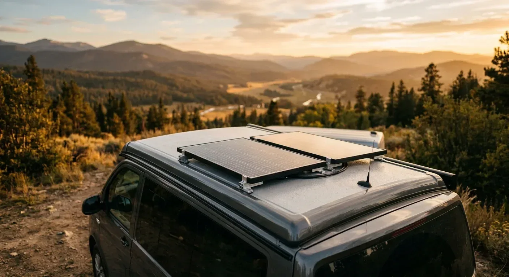

Als ich damals die zwei 100-Watt-Panels auf mein Camper-Dach geklebt habe, stand ich vor der großen Frage: Reihe oder parallel? Am Ende entscheidet diese kleine Steckverbindung nicht nur darüber, wie viel Strom bei Bewölkung in der Batterie landet, sondern auch, wie dick die Kabel sein müssen.

Schaltest du die Panels in Reihe (hintereinander), addiert sich die Spannung. Der große Vorteil: Der Laderegler springt morgens oder bei bewölktem Himmel viel früher an. Weil die Spannung hoch genug ist, lädt die Batterie selbst bei Schwachlicht noch. Bei einer Parallelschaltung dagegen bricht die Spannung bei Wolken so stark ein, dass der Laderegler oft komplett abschaltet.

Der Haken bei der Reihenschaltung? Wenn ein Panel im Schatten steht – etwa durch einen Ast oder die Dachbox –, zieht es das andere Panel mit runter. Bei der Parallelschaltung liefert das sonnige Panel weiter volle Leistung, allerdings fließen hier dauerhaft deutlich höhere Ströme durch die Leitung. Und das hat direkte Folgen für deine Kabel.

Ein konkretes Rechenbeispiel bei 4 Metern Kabelweg und zwei 100-Watt-Panels zeigt das deutlich:

* **In Reihe (5,5 A bei 24 V):** Da die Spannung hoch und der Strom niedrig bleibt, reicht ein dünneres Kabel mit **2,5 mm²** (rechnerisch genügen 1,64 mm²).
* **Parallel (11 A bei 12 V):** Durch den doppelten Strom brauchst du ein deutlich dickeres Kabel von **8 mm²** (rechnerisch 6,55 mm²), um Leistungsverluste zu vermeiden.

Wenn du den passenden Querschnitt für dein eigenes Projekt ermitteln willst, kannst du das ganz einfach mit dem [Kabelquerschnitt-Rechner](https://camper-elektrik-planer.de/de/kabelquerschnitt-berechnen/) tun. Um deine gesamte Solarverkabelung mit Batterie und Laderegler zu planen, hilft dir der [Camper-Elektrik-Planer](https://camper-elektrik-planer.de/).
