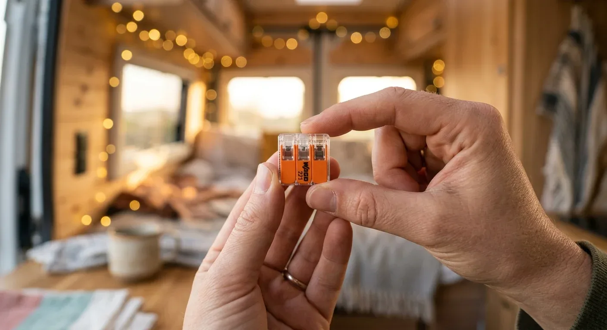

Lüsterklemmen haben im Camper absolut nichts verloren. Durch die ständigen Vibrationen auf der Straße lockern sich die Schraubverbindungen mit der Zeit. Die Folge: Der Übergangswiderstand steigt, es entsteht Hitze und im schlimmsten Fall ein Kabelbrand durch Lichtbögen. Crimpen ist zwar eine saubere Alternative, erfordert aber für jede Steckergröße teures Spezialwerkzeug und extrem präzises Arbeiten.

Die Wago-Klemme der Serie 221 löst dieses Problem komplett. Hebel auf, abisoliertes Kabel rein, Hebel zu. Die Klemme fixiert die feindrähtigen, flexiblen Adern, die für den Fahrzeugausbau vorgeschrieben sind, mit einer internen Stahlfeder. Diese Verbindung ist dauerhaft vibrationssicher, wartungsfrei und lässt sich jederzeit ohne Werkzeug wieder lösen.

Ein fataler Fehler ist es jedoch, die Klemmen einfach lose hinter der Wandverkleidung fliegen zu lassen. Ohne Zugentlastung und ein schützendes Gehäuse beziehungsweise eine Verteilerdose riskierst du, dass die Kabel bei Erschütterungen oder Zugbelastung herausreißen. Nutze stattdessen die passenden Montageadapter, um die Wagos fest auf dem Untergrund zu verschrauben.

Beim Querschnitt lauert die nächste Stolperfalle. Die weit verbreiteten Standard-Wagos (Serie 221-4xx) sind nur für Kabelquerschnitte bis maximal 4 mm² zugelassen. Im 12-Volt-Netz stößt du damit schneller an die Grenze, als du denkst.

Ein klassisches Beispiel: Du planst eine Kompressor-Kühlbox im Heck deines Vans. Bei einem 12-V-System, einem moderaten Dauerstrom von 5 Ampere und einer einfachen Kabellänge von 500 cm (5 Meter vom Verteiler zum Verbraucher) spuckt die physikalische Berechnung einen erforderlichen Kabelquerschnitt von **6 mm²** aus (rechnerisch 3,72 mm² plus Sicherheitsmarge, was den nächsthöheren Standardquerschnitt von 6 mm² erfordert).

Mit der Standard-Wago bist du hier bereits am Limit und kannst das Kabel nicht mehr sicher klemmen. Für diesen Anwendungsfall musst du zwingend auf die größere Variante (Serie 221-6xx) setzen, die für Querschnitte bis 6 mm² ausgelegt ist. Verwendest du ein zu dünnes Kabel oder eine unterdimensionierte Klemme, drohen hoher Spannungsverlust und eine Kühlbox, die wegen vermeintlicher Unterspannung ständig auf Störung schaltet.

Damit dir solche Planungsfehler beim Ausbau erspart bleiben, solltest du jede Leitung vor dem Kauf genau kalkulieren. Berechne deine Kabel und Klemmen passgenau mit dem [Kabelquerschnitt-Rechner](https://camper-elektrik-planer.de/de/kabelquerschnitt-berechnen/) und sorge für eine sichere Stromversorgung in deinem Van.
