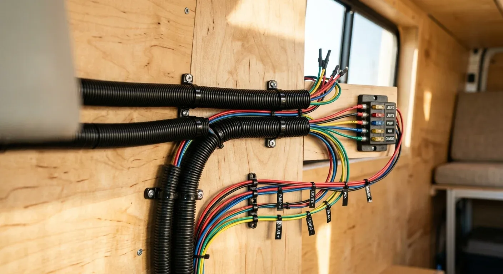

Starre Kabel aus der Hausinstallation haben im Camper nichts verloren. Das habe ich schnell gelernt, als ich meinen ersten Van ausgebaut habe. Durch die ständigen Vibrationen während der Fahrt können starre Kupferadern ermüden und brechen. Deshalb greife ich ausschließlich zu feindrähtigen, flexiblen Kfz-Leitungen. Sie machen jede Bewegung klaglos mit und sorgen dafür, dass die Elektrik auch auf holprigen Schotterpisten absolut zuverlässig bleibt.

Bei der Auswahl stößt man sofort auf die Bezeichnungen FLY und FLRY. Der Unterschied liegt in der Dicke der Isolierung. FLY ist der traditionelle Standard mit einer relativ dicken PVC-Hülle. FLRY hingegen steht für eine reduzierte Wandstärke (das „R“ in der Bezeichnung). Das Geniale an FLRY: Der Kupferkern bleibt gleich, aber durch die dünnere Isolierung ist das Kabel viel schlanker und leichter. Wenn man dutzende Meter Kabel durch enge Leerrohre ziehen muss, spart das extrem viel Platz und Nerven.

FLRY gibt es wiederum in zwei Varianten, die sich durch den Aufbau des Kupferleiters unterscheiden:

* **FLRY-A:** Die einzelnen Drähte im Inneren sind besonders dünn. Dadurch ist das Kabel extrem biegsam und lässt sich hervorragend um sehr enge Ecken verlegen.
* **FLRY-B:** Hier sind die Einzeldrähte etwas dicker. Das Kabel ist dadurch minimal steifer, aber mechanisch robuster und widerstandsfähiger beim Einziehen.

In meinem Van habe ich das so aufgeteilt: FLRY-A kam überall dort zum Einsatz, wo es wirklich eng zuging und nur minimale Ströme fließen – zum Beispiel bei den LED-Decken-Spots und den feinen Leitungen für die Tanksensoren. Für USB-Steckdosen und die Zuleitungen zu den größeren Verbrauchern habe ich FLRY-B genutzt, weil die Kabel beim Einziehen in die Wellschläuche etwas mehr Zug vertragen.

Auch wenn die dünne Isolierung von FLRY Platz spart: Am tatsächlichen Kupferquerschnitt darf niemals gespart werden. Welchen Querschnitt eine Leitung braucht, hängt immer vom Strom und der Kabellänge ab, damit der Spannungsverlust minimal bleibt und die Geräte die volle Leistung bekommen.

Für meine Kompressorkühlbox, die auf 12 Volt läuft und einen Dauerstrom von 5 Ampere zieht, musste ich eine Strecke von 4 Metern (einfache Länge) überbrücken. Mit dem passenden Berechnungs-Tool ergibt sich dafür ein exakter Mindestquerschnitt von 4 mm². Weniger Kupfer würde dazu führen, dass an der Kühlbox zu wenig Spannung ankommt und sie im Sommer unnötig oft anspringt oder abschaltet.

Wer gerade seine eigene Elektrik plant und nicht sicher ist, welche Kabelstärken für die Verbraucher nötig sind, kann den passenden Querschnitt ganz einfach mit dem [Kabelquerschnitt-Rechner](https://camper-elektrik-planer.de/de/kabelquerschnitt-berechnen/) ermitteln. Für die komplette Planung aller Komponenten und des gesamten Systems hilft der [Camper Elektrik Planer](https://camper-elektrik-planer.de/) beim Erstellen des optimalen Schaltplans.
