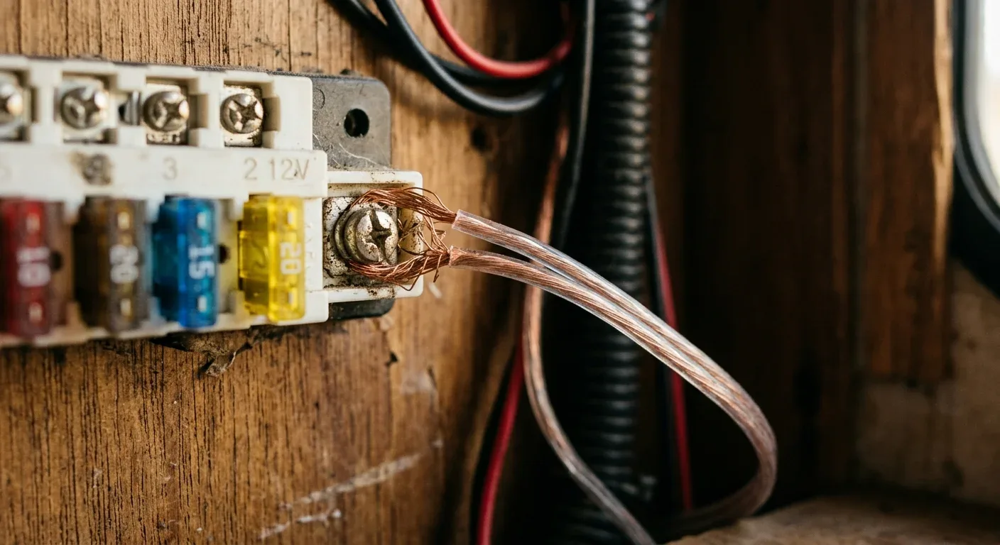
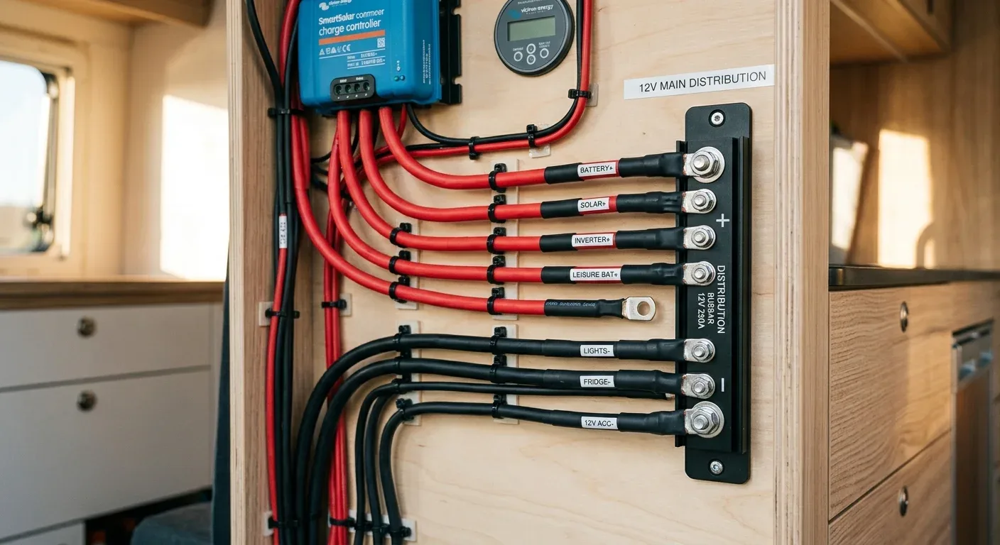

Du hast bestimmt noch diese Rolle transparentes oder rot-schwarzes Lautsprecherkabel im Keller liegen. Schnell mal die Kühlbox oder die LED-Leiste im Camper damit verkabelt – Kupfer ist schließlich Kupfer, oder? Ein fataler Fehler, der dir im schlimmsten Fall den ganzen Van abfackelt.

Das Problem ist meistens gar nicht der Kupferkern an sich, sondern das, was drumherum ist: die Isolierung. Lautsprecherleitungen haben in der Regel eine einfache PVC-Hülle. Wenn diese durch Überlastung, einen Kurzschluss oder eine Scheuerstelle am Blech heiß wird, fängt sie extrem leicht Feuer, tropft brennend ab und setzt dichte, hochgiftige Gase frei. 

Echte Kfz-Leitungen (wie FLRY oder FLY) sind nach der Norm ISO 6722 zertifiziert. Ihre Isolierung ist flammhemmend und selbstlöschend. Wenn die Sicherung fliegt und die Hitzequelle weg ist, geht das Feuer am Kabel sofort von alleine aus. Lautsprecherkabel brennen einfach munter weiter.

Dazu kommt, dass dünne Lautsprecherstrippen im 12-Volt-Netz extrem schnell überhitzen. Im Niedervoltbereich unterschätzt man den nötigen Querschnitt fast immer. 

Ein konkretes Beispiel: Eine normale Kompressor-Kühlbox zieht unter Last rund 10 Ampere. Steht sie in 4 Metern Entfernung (einfache Kabellänge = 400 cm) von der Batterie, benötigst du bei 12 Volt Systemspannung einen Kabelquerschnitt von satten **8 mm²**, um den Spannungsabfall unter den kritischen 2 % zu halten. 

Würdest du hier ein typisches 1,5 mm² oder 2,5 mm² Lautsprecherkabel verwenden, fällt so viel Spannung auf dem Weg ab, dass die Kühlbox wegen Unterspannung ständig abschaltet – während das Kabel im Dauerbetrieb gefährlich heiß wird.

Mach es von Anfang an richtig: Verwende ausschließlich zertifizierte Fahrzeugleitungen, crimpe ordentliche Kabelschuhe auf und sichere jede Leitung direkt nach der Stromquelle passend ab.

Bevor du Kabel kaufst: Rechne die Querschnitte für jeden einzelnen Verbraucher exakt aus. Mit dem [Kabelquerschnitt-Rechner von camper-elektrik-planer.de](https://camper-elektrik-planer.de/de/kabelquerschnitt-berechnen/) kriegst du den passenden Durchmesser in Sekunden geliefert.
