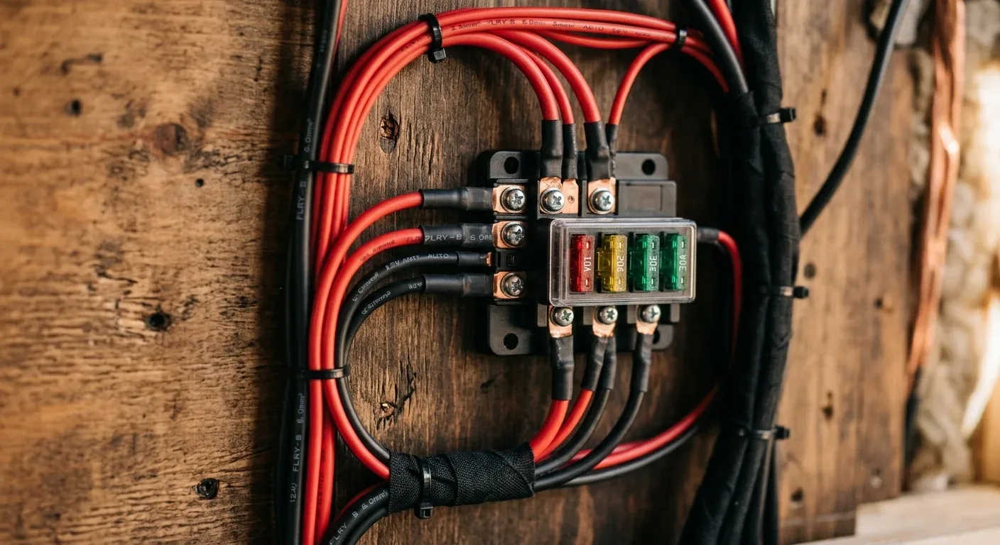

Mal eben die USB-Buchse oder die LED-Leiste verkabeln und im Keller liegt noch eine alte Rolle Lautsprecherkabel? Klingt nach einem schnellen, kostenlosen Hack. Kupfer ist schließlich Kupfer, oder?

Genau dieser Gedanke ist brandgefährlich.

Das Problem bei Lautsprecherkabeln im Camper ist nicht, dass der Strom nicht durchfließt. Das Problem ist der Mantel.

Klassische Lautsprecherleitungen haben eine einfache PVC-Isolierung. Wenn es hier durch Überlastung oder einen Scheuerpunkt zu einem Kurzschluss kommt, schmilzt die Isolierung nicht nur – sie fängt Feuer. Im schlimmsten Fall wirkt der PVC-Mantel wie ein Docht, der die Flammen rasant durch die Wandverkleidung deines Vans transportiert.

### Warum echte Kfz-Kabel den Unterschied machen

Zertifizierte Fahrzeugleitungen (wie FLRY oder FLY) sind nach ISO 6722 spezifiziert. Sie sind flammhemmend und selbstverlöschend. Das bedeutet: Wenn dort ein Kurzschluss entsteht, schmilzt das Kabel zwar im Extremfall, aber es trägt kein offenes Feuer weiter. Sobald die Hitzequelle weg ist, erlischt die Flamme von selbst. 

Zudem ist die Isolierung von Fahrzeugleitungen deutlich robuster gegen Vibrationen, Scheuern und die typischen Temperaturschwankungen im Auto.

### Ein schnelles Rechenbeispiel

Nehmen wir an, du willst eine Kühlbox oder eine Standheizung beim Starten mit 10 A betreiben. Die einfache Kabellänge vom Verteiler zum Gerät beträgt 3 Meter (300 cm) in einem 12-V-System.

Gibst du diese Werte in den Rechner ein, benötigt das System einen Kabelquerschnitt von **6 mm²** (rechnerisch 4,46 mm², aufgerundet auf die nächste Standardgröße). 

Ein typisches Lautsprecherkabel aus der Grabbelkiste hat meistens nur einen Querschnitt von 0,75 mm² bis maximal 2,5 mm². Es wäre für diesen Anwendungsfall massiv unterdimensioniert, würde im Betrieb heiß laufen und bei einem Kurzschluss sofort den Van entzünden.

### So machst du es richtig

1. **Verwende ausschließlich Fahrzeugleitungen** (z. B. FLRY-B) für deine 12-V-Installation.
2. **Berechne jeden Querschnitt exakt** nach Stromstärke und Kabellänge.
3. **Sichere jedes Kabel** so nah wie möglich an der Stromquelle passend ab.

Keine Experimente bei der Sicherheit. Nutze den [Kabelquerschnitt-Rechner](https://camper-elektrik-planer.de/de/kabelquerschnitt-berechnen/), um deine Leitungen präzise zu dimensionieren, und plane deine gesamte Installation fehlerfrei im [Camper-Elektrik-Planer](https://camper-elektrik-planer.de/).
