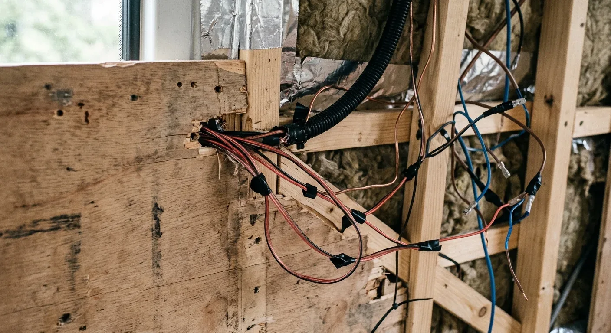
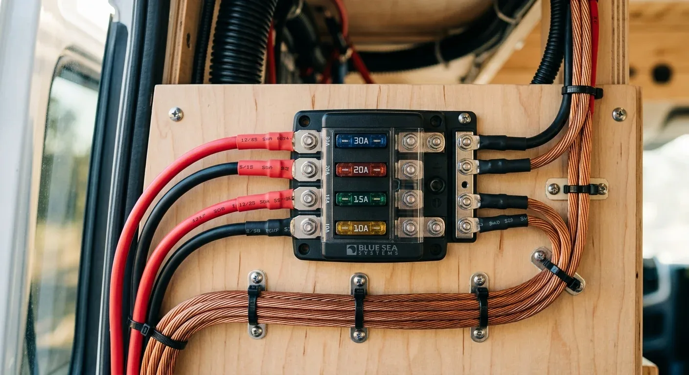

Mal eben die Reste aus der HiFi-Kiste für die 12-V-Verkabelung im Camper nutzen? Klingt nach einem smarten Hack, um ein paar Euro zu sparen. Ist aber der direkteste Weg zum Kabelbrand oder zu einer streikenden Kühlbox. Kupfer ist schließlich Kupfer, oder? Falsch gedacht.

Die meisten billigen Lautsprecherkabel bestehen nicht aus reinem Kupfer, sondern aus sogenanntem CCA (*Copper Clad Aluminium*). Das ist ein billiger Aluminiumkern, der nur hauchdünn mit Kupfer überzogen ist. Aluminium leitet Strom deutlich schlechter als Kupfer. Der elektrische Widerstand ist rund 1,5-mal so hoch. Das bedeutet für dich: Mehr Hitze im Kabel, massiver Spannungsabfall am Endgerät und im schlimmsten Fall ein schmelzendes Kabel hinter deiner Holzverkleidung.

Dazu kommt das Risiko bei der Isolierung. Die weiche, leicht flexible PVC-Hülle von HiFi-Kabeln ist für das heimische Wohnzimmer gemacht – nicht für den Camper. Im Fahrzeug vibriert alles, Kabel scheuern an scharfen Blechkanten, und im Sommer herrschen hinter den Verkleidungen schnell mal über 60 °C. Normale Lautsprecherkabel werden bei Hitze extrem weich und scheuern schnell durch. Echte Fahrzeugleitungen (wie FLY oder FLRY) haben eine deutlich härtere, hitzebeständige und vibrationsfeste Isolierung, die genau dafür ausgelegt ist. Kurzschlüsse und Brände werden so effektiv verhindert.

Was das in der Praxis bedeutet, zeigt ein schnelles Rechenbeispiel für eine Standard-Kompressorkühlbox. 

Die Box zieht im Betrieb etwa 6 Ampere Dauerstrom und steht im Heck – das macht bei einer sauberen Kabelverlegung schnell 4 Meter einfache Strecke (400 cm) vom Verteiler bis zur Steckdose. Jagst du diesen Strom durch ein typisches, dünnes Lautsprecherkabel, kommt an der Kühlbox viel zu wenig Spannung an. Die Folge: Der integrierte Batteriewächter der Kühlbox meldet sofort "Unterspannung" und schaltet den Kompressor ab, obwohl deine Batterie randvoll ist. Deine Getränke bleiben warm.

Rechnest du den Fall durch, spuckt der [Kabelquerschnitt-Rechner](https://camper-elektrik-planer.de/de/kabelquerschnitt-berechnen/) ein ganz anderes Ergebnis aus: Um den Spannungsabfall unter den kritischen 2 % zu halten, benötigst du bei 12 V Systemspannung und 4 Metern Länge für die 6 A eine echte Kupferleitung mit mindestens **6 mm²** Querschnitt (rechnerisch 3,57 mm² plus Sicherheitsmarge, aufgerundet auf die nächste Standardgröße). Ein dünnes Lautsprecherkabel ist hier eine echte Brandgefahr.

Spar also nicht am falschen Ende. Schmeiß die Restekiste weg und greif zu echten Kfz-Leitungen (z. B. FLRY). Wenn du wissen willst, welche Kabelstärken du für deine restlichen Verbraucher wie USB-Dosen, LED-Spots oder den Ladebooster brauchst: Berechne jeden Querschnitt einzeln mit dem [Kabelquerschnitt-Rechner](https://camper-elektrik-planer.de/de/kabelquerschnitt-berechnen/). 

Für die gesamte Planung deines Systems inklusive Sicherungen und passender Stückliste nutzt du am besten direkt unseren kostenlosen [Camper-Elektrik-Planer](https://camper-elektrik-planer.de/).
