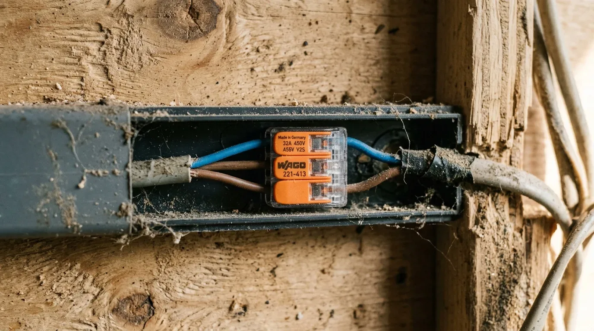

Wer beim Camper-Ausbau zum Lötkolben greift, um Kabel zu verbinden, baut sich eine tickende Zeitbombe ein. Was in der Werkstatt am Schreibtisch hält, vibriert sich auf der Straße in kürzester Zeit kaputt.

Das Problem ist der Kapillareffekt: Beim Löten saugt sich das flüssige Zinn unter die Isolierung des flexiblen Kupferkabels. Dadurch wird die feindrähtige Leitung genau am Übergang zur Lötstelle starr. Durch die permanenten Schwingungen beim Fahren bricht das Kupfer direkt hinter dieser harten Stelle ab. Die Folge: Wackelkontakte oder ein Kabelbrand durch Lichtbögen.

Im Camper sind mechanische Federzugverbindungen deshalb Pflicht. Wago-Klemmen der Serie 221 nutzen eine Edelstahl-Käfigzugfeder, die permanenten Druck auf die Ader ausübt. Vibrationen werden dynamisch ausgeglichen, statt das Material zu ermüden.

Die Anwendung ist simpel: Hebel auf, abisoliertes Kabel rein, Hebel zu. Kein Spezialwerkzeug, kein Gefummel.

Bevor du klemmst, muss aber der Kabelquerschnitt stimmen. Ein zu dünnes Kabel glüht dir weg – egal wie gut die Verbindung ist. 

Ein Beispiel: Ein 12-V-Kompressorkühlschrank zieht ca. 5 A Dauerstrom. Bei 300 cm einfachem Kabelweg vom Verteiler zum Gerät spuckt die Formel einen rechnerischen Querschnitt von 2,23 mm² aus. Inklusive 12 % Sicherheitsmarge landen wir beim nächsten Standard-Querschnitt von **4 mm²**.

Rechne deine Kabelwege lieber einmal zu viel durch. Mit unserem [Kabelrechner](https://camper-elektrik-planer.de/de/kabelquerschnitt-berechnen/) ermittelst du in Sekunden den exakten Querschnitt und verhinderst gefährlichen Spannungsabfall. Für die gesamte Verkabelung inklusive Schaltplan und Stückliste nutzt du am besten direkt den [Camper-Elektrik-Planer](https://camper-elektrik-planer.de/).
