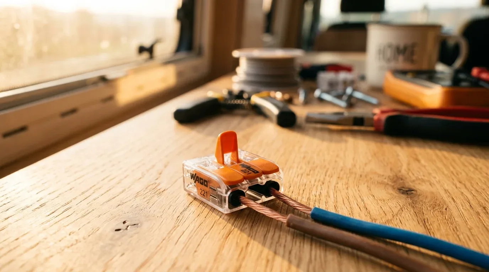

Wer beim Camper-Ausbau an Wago-Klemmen spart und stattdessen zu billigen Lüsterklemmen aus der Restekiste greift, baut sich eine tickende Zeitbombe ein. Lüsterklemmen sind für die starre Hausinstallation gedacht, die fest in der Wand liegt und sich niemals bewegt. Im Camper vibriert, rüttelt und schüttelt sich permanent alles. Über die Kilometer lockern sich die winzigen Schrauben der Lüsterklemmen. Die Folge: Der Übergangswiderstand steigt, es entstehen Funken oder Lichtbögen – und am Ende brennt der Van.

Im Fahrzeugbereich verlegst du ausschließlich flexible Fahrzeugleitungen (Litzen aus vielen feinen Kupferdrähten). Wenn du hier die Schraube einer Lüsterklemme ohne Aderendhülse direkt auf das Kabel drehst, zerquetscht und zerschneidest du die dünnen Äderchen. Das Kabel bricht ab, der Querschnitt schrumpft massiv. 

Wago-Hebelklemmen der Serie 221 arbeiten völlig anders: Sie halten den Draht mit einer Edelstahl-Käfigzugfeder. Diese Feder gleicht jede Vibration während der Fahrt aus, drückt permanent mit exakt der richtigen Kraft und beschädigt das Kupfer nicht. Du klappst einfach den Hebel auf, steckst die abisolierte Litze rein, Hebel zu – bombenfest, sicher und jederzeit wieder lösbar.

Zudem scheitern Lüsterklemmen schlicht an den Strömen im 12-Volt-Netz. Weil die Spannung so niedrig ist, fließen für dieselbe Leistung viel höhere Ströme als im 230-V-Hausnetz. Ein Verbraucher mit 15 A Stromstärke (wie eine Dieselheizung im Startmoment oder eine große Kühlbox), der in 3 Metern Entfernung zur Batterie verbaut ist, benötigt bei 12 V Spannung bereits einen Kabelquerschnitt von **8 mm²** (rein rechnerisch 6,7 mm² inklusive Sicherheitszuschlag). Solch ein dickes Kabel bekommst du in keine Standard-Lüsterklemme hineingefummelt – in die größeren Wago-Klemmen dagegen problemlos.

Sicherheit in der Camper-Elektrik beginnt vor der Klemme. Berechne jeden deiner Kabelwege exakt mit dem [Kabelquerschnitt-Rechner](https://camper-elektrik-planer.de/de/kabelquerschnitt-berechnen/), um Kabelbrände zu verhindern. Deinen kompletten Schaltplan inklusive aller Absicherungen und der passenden Stückliste erstellst du fehlerfrei im [Camper-Elektrik-Planer](https://camper-elektrik-planer.).
