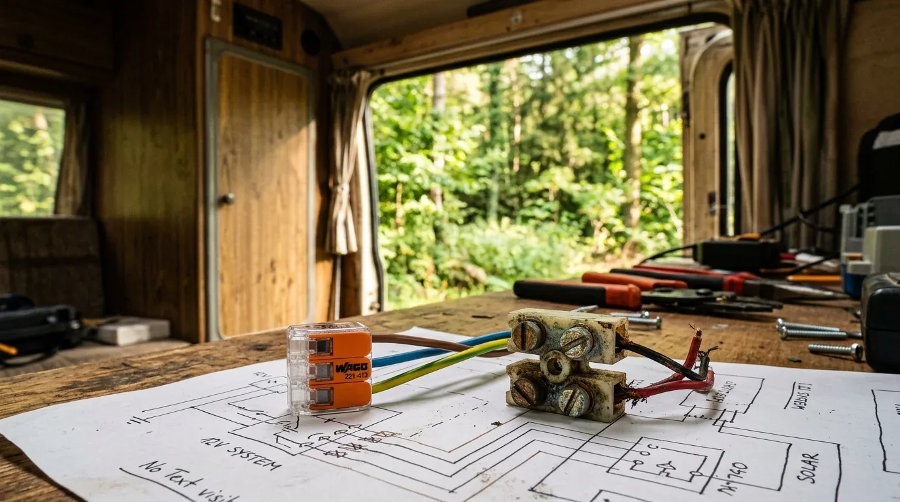

Wer im Camper noch Lüsterklemmen verbaut, riskiert im schlimmsten Fall ein ausgebranntes Auto. Was zu Hause in der Deckenlampe starr und unbeweglich sitzt, wird im Van zur tickenden Zeitbombe. Ein Camper vibriert, rüttelt und schüttelt sich auf jeder Schotterpiste.

Das Problem mit der Lüsterklemme: Die kleine Schraube drückt direkt auf die feinen Drähte (Litzen) deines Kabels. Durch die ständige Vibration während der Fahrt lockert sich diese Schraubverbindung schleichend. Gleichzeitig können die starren Schrauben die feinen Kupferdrähte beschädigen oder ganz abscheren. Die Folge: Der Kontakt wird schlechter, der Übergangswiderstand steigt, die Stelle wird extrem heiß – und fängt irgendwann Feuer.

### Die Lösung: Wago 221

Für den Camper-Ausbau gibt es deshalb nur eine sinnvolle Wahl: **Wago-Hebelklemmen der Serie 221**. Sie arbeiten nicht mit Schrauben, sondern mit einer patentierten Federzugtechnik.

* **Vibrationsfest:** Die integrierte Stahlfeder drückt dauerhaft mit exakt der richtigen Kraft auf das Kabel. Da lockert sich selbst auf der härtesten Offroad-Piste nichts.
* **Keine Aderendhülsen nötig:** Du kannst flexible Litzen einfach abisolieren, Hebel auf, Kabel rein, Hebel zu. Die Klemme beschädigt das Kupfer nicht.
* **Wiederverwendbar:** Hebel wieder auf, Kabel raus – perfekt, wenn du später etwas am Layout ändern willst.

**Wichtig beim Kauf:** Greife unbedingt zum Original (Wago 221) und lass die Finger von billigen Klonen aus dem Netz. Die Original-Klemme ist für Ströme bis 32 A zugelassen und hält den Belastungen im Camper sicher stand.

### Ein konkretes Rechenbeispiel

Stell dir vor, du planst einen Lichtkreis für das Heck deines Vans. Daran hängen mehrere LED-Spots und zwei USB-Ladebuchsen. 

* **Systemspannung:** 12 V
* **Stromstärke:** 5 A
* **Kabellänge (einfacher Weg):** 4 Meter (400 cm)

Wenn du diese Werte mit einem maximal zulässigen Spannungsabfall von 2 % berechnest, benötigst du einen Kabelquerschnitt von **4 mm²**. 

Das Geniale: Ein Kabel mit 4 mm² Querschnitt passt exakt in die Standard-Variante der Wago-Klemme 221 (Modelle 221-412, 221-413, 221-415), die für Querschnitte von 0,2 bis 4 mm² ausgelegt ist. Erst wenn du noch dickere Kabel anschließen willst, musst du auf die größere Variante Wago 221-61x (bis 6 mm²) ausweichen.

Damit dir beim Ausbau kein Kabel wegschmilzt, solltest du jeden einzelnen Leitungsabschnitt vorher exakt berechnen. Nutze dafür direkt unseren [Kabelquerschnitt-Rechner](https://camper-elektrik-planer.de/de/kabelquerschnitt-berechnen/), um den passenden Querschnitt für deine Wago-Verbindungen zu ermitteln. Wenn du die komplette Elektrik deines Vans sicher und fehlerfrei planen willst, zeichne deinen Schaltplan am besten direkt im [Camper-Elektrik-Planer](https://camper-elektrik-planer.de/).
