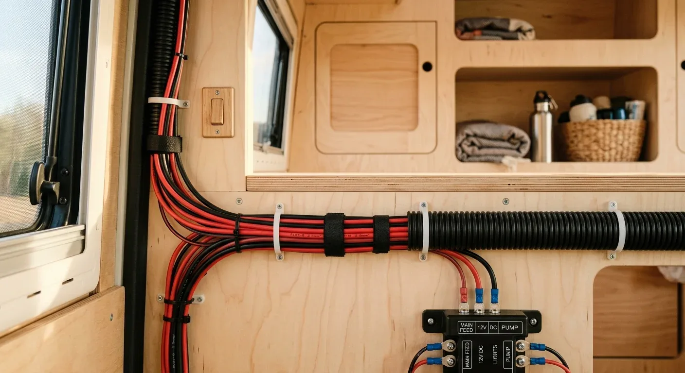

Als ich meinen ersten Van ausgebaut habe, stand ich im Baumarkt vor dem Kabelregal und war kurz versucht, die Standard-Leitungen für die Hausinstallation zu nehmen. Zum Glück habe ich mich vorher noch mal eingelesen. Starre Kupferadern haben im Camper nämlich nichts zu suchen. Durch die ständigen Vibrationen während der Fahrt müssen die Kabel flexibel bleiben, um dauerhaft eine zuverlässige Verbindung zu sichern. Deshalb gehören ausschließlich feindrähtige Fahrzeugleitungen in den Van. Meine Wahl fiel schnell auf FLRY-Leitungen. Das „R“ steht hier für eine reduzierte Wandstärke der Isolierung. Das bedeutet: Der Außendurchmesser ist deutlich kleiner als bei herkömmlichen FLY-Kabeln. Wenn man wie ich versucht, möglichst viele Leitungen sauber in ein enges Wellrohr zu quetschen, ist man um jeden Millimeter froh, den man spart.

Beim Kauf stößt man schnell auf die Varianten FLRY-A und FLRY-B. Der Unterschied liegt im Aufbau des Kupferleiters im Inneren. 

Bei FLRY-A bestehen die Adern aus wenigen, dafür aber etwas dickeren Einzeldrähten. Das macht das Kabel insgesamt ein wenig starrer, aber auch extrem kompakt in der Außenabmessung. Ich nutze FLRY-A vor allem für gerade Strecken, feste Signalleitungen oder Steuerleitungen, die einmal sauber verlegt werden und sich danach nicht mehr bewegen müssen.

FLRY-B hingegen setzt auf viele, dafür sehr feine Einzeldrähte. Dadurch ist das Kabel wunderbar flexibel und lässt sich geschmeidig um engste Radien legen. Für mich ist FLRY-B der perfekte Allrounder im Camper-Ausbau. Überall dort, wo Leitungen durch Kurven geführt werden müssen oder an Bauteilen hängen, die sich bewegen, greife ich zu dieser Variante.

Wie wichtig die richtige Dimensionierung ist, zeigt sich gut an einem konkreten Beispiel aus meinem Ausbau: Meine 12-V-Kompressorkühlbox steht hinten im Heck, der Weg von der Versorgungsbatterie beträgt einmal quer durch den Van gute 400 Zentimeter. Bei einer typischen Stromstärke von 5 Ampere im Betrieb habe ich das Ganze durchgerechnet. 

Unter Berücksichtigung der Kabellänge und eines minimalen Spannungsabfalls für eine effiziente Kühlung ergibt die Berechnung einen benötigten Querschnitt von rechnerisch 2,98 mm². Inklusive einer Sicherheitsmarge von 12 Prozent lande ich damit beim nächsten standardmäßigen Querschnitt von 4 mm². Mit einer FLRY-B-Leitung in 4 mm² läuft die Box seit dem ersten Tag absolut stabil und effizient.

Damit bei deiner Planung alles glattgeht und du nicht schätzen musst, empfehle ich dir, jeden Kabelweg vorab genau zu bestimmen. Auf [camper-elektrik-planer.de](https://camper-elektrik-planer.de/) kannst du deinen gesamten Schaltplan digital zeichnen, und mit dem integrierten [Kabelrechner](https://camper-elektrik-planer.de/de/kabelquerschnitt-berechnen/) hast du die passenden Querschnitte für jedes deiner Geräte im Handumdrehen ermittelt.
