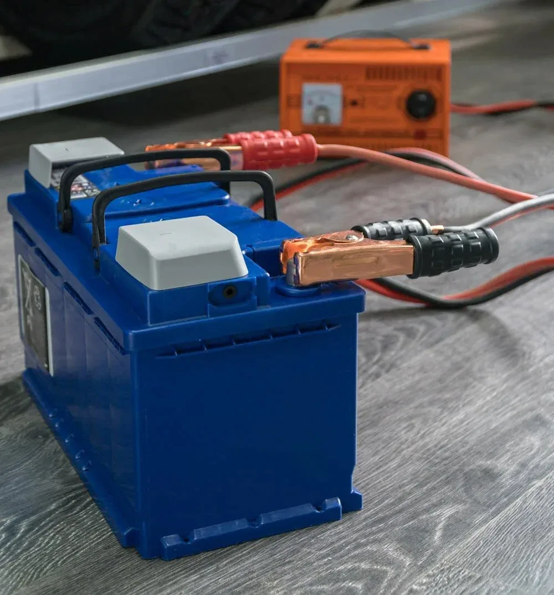

Wer seine Camper-Elektrik plant, steht schnell vor einem gewaltigen Haufen Buchstabensalat. Auf der Kühlbox stehen Watt, auf der Wasserpumpe Ampere, auf der Powerbank Milliamperestunden (mAh) und der Solarregler will plötzlich Wattstunden (Wh) wissen. Warum machen die Hersteller das? Weil große Zahlen im Marketing besser aussehen. Eine Powerbank mit "20.000 mAh" klingt eben fetter als eine mit mickrigen 74 Wattstunden. 

Für deine Solar- und Batterieplanung ist dieser Mix tödlich. Du kannst Äpfel nicht mit Birnen vergleichen. Um herauszufinden, wie groß deine Batterie und deine Solaranlage wirklich sein müssen, brauchst du eine einzige, einheitliche Währung: **Wattstunden (Wh)** pro Tag. Erst wenn alles in Wh umgerechnet ist, kannst du die Werte einfach zusammenzählen.

Hier sind die vier typischen Fälle, die dir beim Ausbau begegnen, und wie du sie knackst.

### 1. Der Klassiker: Watt (W) direkt gegeben
Manche Verbraucher machen es dir leicht. Auf LED-Strahlern oder dem Handyladegerät steht die Leistung oft direkt in Watt.
* **Beispiel:** Ein LED-Strahler mit **10 W** brennt abends für **3 Stunden**.
* **Rechnung:** 10 W × 3 h = **30 Wh**

### 2. Der Stromfresser: Ampere (A) bei 12 V
Manche 12-V-Geräte geben nur die Stromstärke in Ampere an. Um auf Watt zu kommen, nimmst du die Spannung (im Camper meist 12 V) mal die Ampere.
* **Beispiel:** Eine Druckwasserpumpe zieht **4 A** bei 12 V. Sie läuft am Tag insgesamt vielleicht **6 Minuten** (0,1 Stunden) zum Abwaschen und Händewaschen.
* **Rechnung:** 
  * Erst die Leistung in Watt: 4 A × 12 V = 48 W
  * Dann der Verbrauch: 48 W × 0,1 h = **4,8 Wh**

### 3. Der Marketing-Trick: mAh bei USB-Geräten
Powerbanks und Stirnlampen glänzen mit riesigen mAh-Angaben. Was verschwiegen wird: Diese Kapazität bezieht sich fast immer auf die interne Akkuzelle mit 3,7 Volt – nicht auf die 5 Volt am USB-Ausgang oder die 12 Volt im Camper.
* **Beispiel:** Du willst eine Powerbank mit **10.000 mAh** laden. 
* **Rechnung:** 
  * Erst Milliamperestunden in Amperestunden umrechnen: 10.000 mAh / 1.000 = 10 Ah
  * Dann mit der Zellspannung multiplizieren: 10 Ah × 3,7 V = **37 Wh**

### 4. Das Phantom: Geräte mit Einschaltdauer
Eine Kompressorkühlbox läuft nicht durch. Sie springt an, kühlt runter und schaltet sich wieder ab. Wie oft sie anspringt, hängt von der Außentemperatur ab. Man rechnet im Schnitt mit einer Einschaltdauer von ca. 25 Prozent.
* **Beispiel:** Eine Kompressorkühlbox hat eine Leistungsaufnahme von **45 W** und läuft über 24 Stunden verteilt etwa ein Viertel der Zeit.
* **Rechnung:** 45 W × 24 h × 0,25 = **270 Wh**

### Der Sicherheits-Check: Warum die Leistung auch dein Kabel bestimmt
Die Stromstärke entscheidet nicht nur darüber, wie schnell die Batterie leer ist – sie bestimmt auch, wie dick deine Kabel sein müssen. Zu dünne Kabel bedeuten Spannungsabfall. Das führt dazu, dass die Kühlbox wegen Unterspannung abschaltet, obwohl die Batterie noch voll ist. Im schlimmsten Fall droht ein Kabelbrand.

Nehmen wir unsere 45-W-Kühlbox aus dem Beispiel oben. Bei 12 V zieht sie im Betrieb exakt **3,75 A** (45 W / 12 V). Liegt die Kühlbox im Heck des Vans und du brauchst eine einfache Kabellänge von **4 Metern** (400 cm) bis zur Batterie, spuckt der Sicherheits-Rechner für diesen Fall einen Mindestquerschnitt von exakt **4 mm²** aus. Nimmst du stattdessen ein dünneres Kabel, riskierst du Fehlfunktionen und Hitzeentwicklung. Berechne deine Leitungen im Zweifel immer selbst mit dem [Kabelquerschnitt-Rechner](https://camper-elektrik-planer.de/de/kabelquerschnitt-berechnen/).

### Mach es dir einfach: Der No-Brainer-Weg
Du hast keine Lust, für jedes Gerät einzeln den Taschenrechner zu zücken, die Einschaltdauer zu schätzen und am Ende doch einen Verbraucher zu vergessen? Musst du auch nicht. 

Mit dem [Camper-Elektrik-Planer](https://camper-elektrik-planer.de/) trägst du deine Geräte einfach per Klick in eine Liste ein. Das Tool rechnet die Einheiten im Hintergrund automatisch um, erstellt deine persönliche Energiebilanz und sagt dir sofort, wie groß deine Batterie und deine Solaranlage sein müssen. Kein Mathe-Frust, keine Brandgefahr – einfach funktionierende Elektrik.
