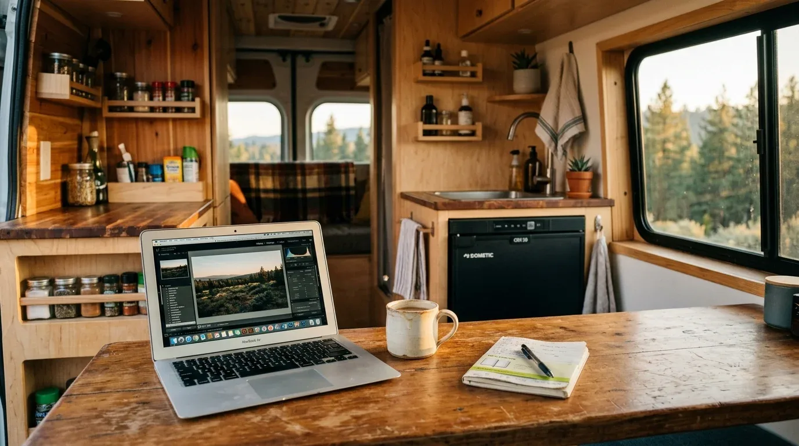

Einfach mal das dicke 400-Watt-Solarset und die größte Lithium-Batterie in den Warenkorb klicken, weil „sicher ist sicher“? Kannst du machen. Kostet dich aber unnötig viel Geld, nimmt wertvollen Platz weg und bringt Gewicht auf die Waage, das du beim Ausbau an anderer Stelle bitter bereust. Wer blind überdimensioniert, plant am eigenen Bedarf vorbei.

Der clevere Weg startet mit einer echten Bestandsaufnahme. Statt zu schätzen, rechnest du den Verbrauch deiner Geräte in Amperestunden (Ah) um. Nimm zum Beispiel deinen Kompressorkühlschrank: Läuft er mit 50 Watt an einem 12-V-System, zieht er im Betrieb etwa 4,17 Ampere. Da ein Kühlschrank dank Thermostat nicht dauerhaft durchläuft, sondern etwa zu 30 bis 50 % der Zeit kühlt, verbraucht er in 24 Stunden rund 30 bis 50 Ah. Schreib diese Werte für jeden Verbraucher auf – vom Handy-Ladegerät über die LED-Spots bis zur Standheizung. Nur so siehst du, wie viel Strom du pro Tag wirklich verbrauchst.

Dabei geht es nicht nur um die Batteriekapazität. Auch der kleinste Verbraucher braucht das exakt passende Kabel, damit dir die Bude nicht abbrennt oder der Kühlschrank wegen eines zu hohen Spannungsabfalls ständig auf Störung geht. Legst du für deinen 50-W-Kühlschrank (4,17 A) ein Kabel über eine einfache Strecke von 300 cm, benötigst du bei einem erlaubten Spannungsfall von maximal 2 % und inklusive Sicherheitsmarge einen Kabelquerschnitt von **2,5 mm²**. Bevor du irgendetwas verlegst, solltest du jeden einzelnen Kabelweg präzise berechnen – das geht schnell und schützt vor Kabelbrand auf dem [Kabelquerschnitt-Rechner](https://camper-elektrik-planer.de/de/kabelquerschnitt-berechnen/).

Hast du deinen täglichen Amperestunden-Bedarf ermittelt, bestimmst du die Batteriegröße und deine Ladequellen. Willst du drei Tage autark stehen, muss deine Batterie diesen dreifachen Tagesbedarf liefern können. Erst jetzt entscheidest du sinnvoll: Reicht ein Ladebooster, weil du ohnehin alle zwei Tage weiterreist? Oder brauchst du Solar auf dem Dach, weil du tagelang an einsamen Stränden stehst? Ein ausgewogener Mix spart Gewicht und schont das Budget.

Du musst das nicht alles mühsam auf einem Schmierzettel zusammenrechnen. Trag deine Verbraucher einfach in den [Camper-Elektrik-Planer](https://camper-elektrik-planer.de/) ein. Das Tool erstellt für dich die komplette Energiebilanz, sagt dir genau, wie lange deine Batterie hält, und zeichnet dir am Ende den passenden Schaltplan inklusive aller Sicherungen und Kabelquerschnitte.
